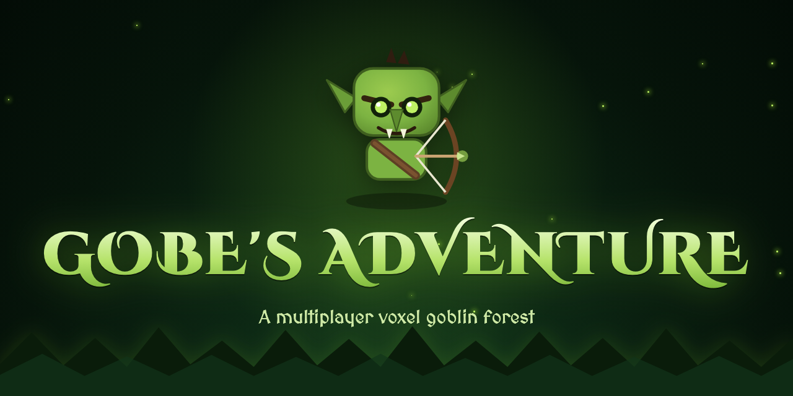

<!-- ════════════════════════════════════════════════════════════════
     BANNER — banner-github.png (1280×640) ships in this repo and shows below.
     X/Twitter header art ships as banner-x.png (1500×500). Square logo = logo.png.
     ════════════════════════════════════════════════════════════════ -->
<p align="center">
  
</p>

<h1 align="center">🧌 GOBE'S ADVENTURE</h1>

<p align="center">
  <b>A multiplayer isometric voxel goblin forest on Solana — raid the wilds, hunt monsters, slay world KINGS, fish, level up & earn $GOBE.</b>
</p>

<p align="center">
  <a href="https://gobesadventure.xyz">🌐 gobesadventure.xyz</a> ·
  🚀 <b>$GOBE token launch: JUL 1 2026 · 6 PM UTC</b> · CA revealed at launch
</p>

<p align="center">
  <a href="https://x.com/gobesadventure">𝕏 / Twitter</a> ·
  <a href="https://t.me/gobesadventure">Telegram</a> ·
  <a href="https://github.com/gobesadventure/gobesadventure">GitHub</a>
</p>

<p align="center">
  
  
  
  
  
</p>

---

## ✨ What is this?

**Gobe's Adventure** is the interactive home of the **$GOBE** token: a browser game where every visitor becomes a **goblin archer** roaming a wild of **30 forest worlds**. No engine, no build step — one HTML file of hand-written Canvas rendering, plus a tiny PHP backend for multiplayer, wallet-bound profiles, claims and an AI goblin shaman.

| | |
|---|---|
| 🏹 **Goblin archer** | Play a green voxel goblin — pointy ears, fangs, leather kit, two legs — who auto-looses **arrows** at monsters. Buy stronger **bows** the deeper you raid. |
| 🌲 **Forest world · 30 islands · 6 regions** | Day/night forest sky (sun, moon, drifting clouds, night aurora), glowing toadstools, goblin totems, wooden watchtowers, level-gated light-bridges between worlds. |
| 🏕 **GOBLIN VILLAGE = safe hub** | The center island is peaceful — every player meets here. Cross the bridges and **everything else is war**. |
| 👹 **Monsters that never stop** | Forest trolls & ogres swarm the outer worlds — **harder every level**. Big brutes shoot back. |
| 👑 **A MONSTER KING per world** | Each world hides a giant crowned boss — tougher each level, huge XP + ⌬ on the kill, returns after a cooldown. |
| 🎣 **ANGLER COVE** | A whole island of **fishing** — a shared 5-seat pier over a lake, charge-aim cast + reel mini-game. Players never enter the water. |
| 🦅 **WAR HAWK mount** | Unlock a giant bird at LV4 — fly anywhere and drop boulders on the horde (no drones in this forest). |
| 🟣 **Phantom = your account** | Connect + signMessage login; progress bound to your wallet, resumes on any device. |
| 🪙 **$GOBE point rewards** | Level up to earn points — claim in-game, receipt by email, airdropped at launch. |
| 👥 **Multiplayer + GRID CHAT** | One shared world; global chat & `/w NAME` whispers. |
| 🧙 **AI goblin SHAMAN (Claude)** | Talk to the SHAMAN — answers in-character via the Anthropic API, and fights beside you once recruited. |
| 🏗 **LAUNCH SPIRE — real time** | A ruined brown spire that **rebuilds itself toward launch** and completes — with 🎆 **fireworks** — at the exact launch second. Live countdown on the landing page too. |

---

## 🎮 How to play

1. **Connect Phantom** on the landing page → enter **Gobe's Adventure**.
2. **Name your goblin** and pick a tribe (NOVA / BLAZE / VOLT / GHOST).
3. **WASD / click** to move · **E** to interact/work · cross the glowing **light bridges** to reach other worlds (some are level-locked 🔒).
4. **Buy a bow at the 🏹 ARMORY**, then raid the outer worlds — you auto-fire at the nearest 👾. Watch your ❤ HP; walk/flee to heal.
5. **Hunt the 👑 MONSTER KING** in each world for big rewards.
6. **Fish** at 🎣 **ANGLER COVE** — board the pier, charge your cast, reel to land the catch.
7. **Level up → earn $GOBE points → CLAIM** (airdropped at launch).

---

## 🚀 Run locally

```bash
# PHP runs the full backend (login / AI shaman / claim / multiplayer):
php -S 127.0.0.1:8000        # ← recommended
# or, visuals only:
python3 -m http.server 8000
```

Open <http://127.0.0.1:8000>. For quick local testing you can skip wallet login with the dev bypass:
`http://127.0.0.1:8000/world.html?unit=NOVA`

---

## 📦 Deploy (Hostinger, split-domain)

```bash
bash build-deploy.sh
```

Produces two drag-and-drop folders:

| Folder | Upload to | Contents |
|---|---|---|
| `deploy/main/` | `gobesadventure.xyz` (root) | landing + `token.js` |
| `deploy/play/` | `play.gobesadventure.xyz` | the game + `api.php` · `mp.php` · `config.php` |

Then copy `config.example.php` → `config.php` and fill in your Anthropic key (AI shaman), SMTP (claim emails) and admin password.

**Token launch:** when the coin goes live, paste the contract address into **one** place — `token.js` → `GOBE_TOKEN.CA` — and the whole site flips from *COMING SOON* to live BUY links.

---

## 🗂 Structure

```
index.html        landing — goblin archer mascot, deep-forest hero, live launch countdown
world.html        THE GAME — ~5k lines of hand-written isometric voxel Canvas
system.html       GOBE SYSTEM utility dashboard
admin.html        claim-list admin panel
token.js          single source of truth for the $GOBE contract address
api.php           wallet profiles · CLAIM · AI shaman (Anthropic)
mp.php            multiplayer state (JSON polling)
config.php        secrets (gitignored) — see config.example.php
build-deploy.sh   builds deploy/main + deploy/play
banner-x.png · banner-github.png · logo.png · favicon.svg/png · og.png
```

---

## 🛠 Tech

- **Frontend:** vanilla JS + a hand-written `<canvas>` isometric voxel renderer. No framework, no build step.
- **Backend:** plain PHP + JSON files (Hostinger-friendly). Per-wallet profiles, CLAIM ledger, AI chat proxy, polling multiplayer.
- **Wallet:** Phantom (connect + signMessage), one wallet = one goblin.
- **Chain:** Solana · pump.fun.

---

<p align="center"><sub>$GOBE · Gobe's Adventure · launch JUL 1 2026 · 6 PM UTC · CA revealed at launch</sub></p>
